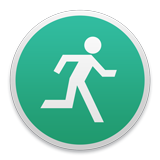

    
    <h3 align="center">AFK</h3>
    
The missing screensaver shortcut for macOS

    
   

## Install

**[Download the latest release](https://github.com/slashjs/afk/releases)** (macOS only)

## About

AFK is a simple menubar application which adds the ability to trigger the screensaver, sleep or lock your mac via a keyboard shortcut *or* right-clicking the application in the menubar.

AFK was created because there is no built-in way to trigger the screensaver on macOS (excluding hot corners).

## Features

* Launch at login
* Invert click/right-click menubar functionality
* Customisable global keyboard shortcut
* Activate from keyboard shortcut *or* right-clicking the application in the menubar
* Three different modes:
	* Screensaver
	* Sleep
	* Lock

# Development

## Contribute

1. [Fork](https://help.github.com/articles/fork-a-repo/) this repository to your own GitHub account and then [clone](https://help.github.com/articles/cloning-a-repository/) it to your local device
2. Install the required dependencies: `npm install`
3. Start file watchers: `gulp`
4. Make some changes! For some inspiration check out existing [issues](https://github.com/slashjs/afk/issues)
5. Run the app: `npm start`
6. Run the code linter: `npm test`
7. Submit a [pull request](https://help.github.com/articles/about-pull-requests/)!

## Build

1. Package the app: `npm run pack`
2. Find the `.app` in: `./dist/mac/`
3. Distribute the app: `npm run dist`
4. Find the `.zip` & `.dmg` in: `./dist/mac/`
