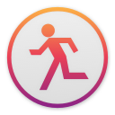

    
    <h3 align="center">AFK</h3>
    
💤 The missing screensaver shortcut for macOS

    
   

## Installation

Download the latest version of AFK from the **[GitHub releases](https://github.com/jamieweavis/afk/releases)** page. (macOS only)

## About

AFK *(away from keyboard)* is a simple menu bar application which adds the ability to trigger the screensaver, sleep, or lock your mac via a configurable keyboard shortcut *or* by right-clicking the application in the menu bar.

AFK was created because there is no built-in way to trigger the screensaver on macOS excluding hot corners.

## Features

* Launch at login
* Hide menu bar icon
* Configurable global hotkey
* Trigger via hotkey *or* right-clicking menu bar icon
* Modes:
	* Screensaver
	* Sleep
	* Lock

## Screenshots

## License

This project is licensed under the MIT License - see the [LICENSE.md](LICENSE.md) file for details.
